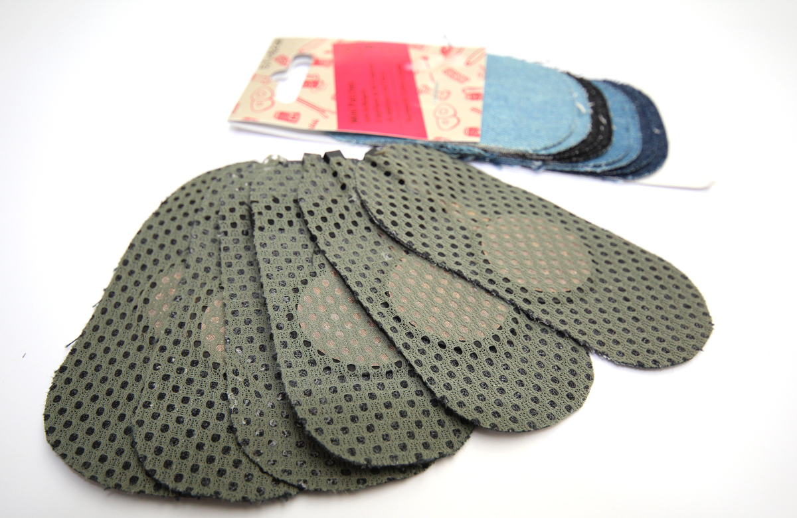
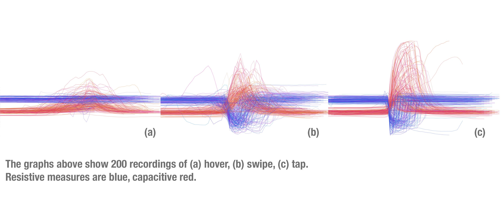
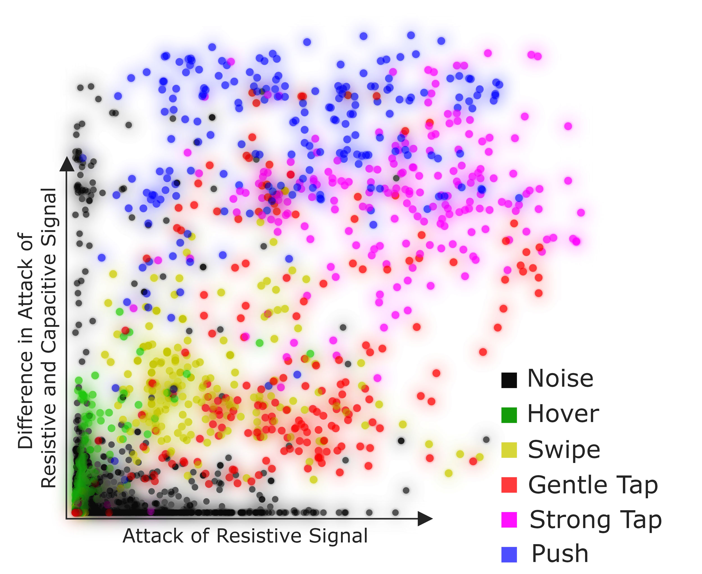

## zPatch - robust textile input

This is the home of zPatch - a sensor design for more robust and versetile textile input.

zPatches were presented as a [paper at TEI 2018](zPatch.github.io/TEI2018_zPatch.pdf).

### How to build a zPatch

A step-by step tutorial on how to build a zPatch zan be found on [Instructables](www.puttheotherlinkhere.com).

### The Code

Once you've built it, zPatch connects to two Analog Inputs of your Arduino. Program it with code you can [find here](https://github.com/zPatch/zPatch.github.io/tree/master/ArduinoCode). (Tested with Arduino v1.8.2 & Arduino Nano, Uno, Mega2560 and the Sparkfun RedBoard)

### Evaluation

We demonstrated the robustness and the ability to detect multiple types of input by recording different gestures and classifying them using Random Forest. We collected 400 measures from ten participants. Of these 400 measures, 300 were noise and the remeining were 5 different input types (Hover, Swipe, Gentle Tap, Strong Tap, Push). Using only the resistive data, we found ~7 instances of noise classified as an input gesture (M: 7.2, SD: 3.42). The capacitive data performed better (M: 4.5, SD: 2.16) and combining both performed  best (M: 3.5, SD: 2.57). Using the combined data, we were able to classify all 6 measure types (Noise + 5 gestures) with a precision and reall of 0.95. 

An interesting point to mention is that combining resistive and capacitive data not only doubles the available data points, we also can learn from their behavior relative to eachother. The graph below shows how the difference in attack of both signals helps classify the gestures correctly:

The recorded data and the software for visualization and preprocessing can be [found here](https://github.com/fkeel/zPatch)

More details can be found in our [paper](zPatch.github.io/TEI2018_zPatch.pdf).

### Credits
zPatch is a project by [Paul Strohmeier](http://www.paulstrohmeier.info), [Jarrod Knibbe](http://www.jarrodknibbe.com), [Sebastian Boring](http://www.sebastianboring.com/) and [Kasper Hornbæk](http://www.kasperhornbaek.dk). The work was done as part of the [Body-UI](http://www.body-ui.eu/) project, supported by ERC Grant 648785
