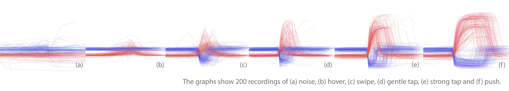

## zPatch - robust textile input

This is the home of zPatch - a sensor design for more robust and versetile textile input.

zPatches were presented as a [paper at TEI](zPatch.github.io/TEI2018_zPatch.pdf).

### How to build a zPatch

A step-by step tutorial on how to build a zPatch zan be found on [Instructables](www.puttheotherlinkhere.com).

We also created a tiny DIY set that we distribute at conferences and events. The DIY set has its own [repo](the.link).

### The Code

Once you've built it, zPatch connects to two Analog Inputs of your Arduino. Program it with code you can [find here](https://github.com/zPatch/zPatch.github.io/tree/master/ArduinoCode). (Tested with Arduino v1.8.2 & Arduino Nano, Uno, Mega2560 and the Sparkfun RedBoard)

### Evaluation

We demonstrated the robustness and the ability to detect multiple types of input by recording different gestures and classifying them using Random Forest. 

The recorded data and the software for visualization and preprocessing can be [found here](https://github.com/fkeel/zPatch)

## Credits
zPatch is a project by [Paul Strohmeier](http://www.paulstrohmeier.info), [Jarrod Knibbe](http://www.jarrodknibbe.com), [Sebastian Boring](http://www.sebastianboring.com/) and [Kasper Hornbæk](http://www.kasperhornbaek.dk). The work was done as part of the [Body-UI](http://www.body-ui.eu/) project, supported by ERC Grant 648785
