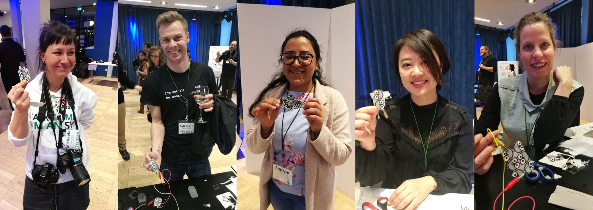

 
## zPatch - robust textile input

This is the home of zPatch - a sensor design for more robust and versatile textile input.

zPatches were presented as a [paper at TEI 2018](zPatch.github.io/TEI2018_zPatch.pdf).

To get an idea of the general concept, check out this [youtube video](https://youtu.be/88QgGQLsvpo)

We recorded some additional footage using Arduino's Serial Plotter. You can see the raw output in three different scenarios here:

* [Demo 1: Basic Touch Dynamics](https://www.youtube.com/watch?v=oIUlfvz92KY)
* [Demo 2: On-Body Interaction](https://www.youtube.com/watch?v=47FtzlK8eNk)
* [Demo 3: Interactions with an Object](https://www.youtube.com/watch?v=6mnFnEgJezA)

The above videos use an Arduino Uno, running [this code](https://github.com/zPatch/zPatch.github.io/tree/master/ArduinoCode) and a zPatch connected to pins A0 and A1 with crocodile clips.

### How to build a zPatch

A step-by step tutorial on how to build a zPatch can be found on [Instructables](https://www.instructables.com/id/ZPatch-Hybrid-ResistiveCapacitive-ETextile-Input).

### The Code

Once you've built it, zPatch connects to two Analog Inputs of your Arduino. Program it with code you can [find here](https://github.com/zPatch/zPatch.github.io/tree/master/ArduinoCode). (Tested with Arduino v1.8.2 & Arduino Nano, Uno, Mega2560 and the Sparkfun RedBoard)

### Evaluation

We demonstrated the robustness and the ability to detect multiple types of input by recording different gestures and classifying them using Random Forest. We collected 400 measures from ten participants. Of these 400 measures, 300 were noise and the remaining were 5 different input types (Hover, Swipe, Gentle Tap, Strong Tap, Push). Using only the resistive data, we found ~7 instances of noise classified as an input gesture (M: 7.2, SD: 3.42). The capacitive data performed better (M: 4.5, SD: 2.16) and combining both performed  best (M: 3.5, SD: 2.57). Using the combined data, we were able to classify all 6 measure types (Noise + 5 gestures) with a precision and recall of 0.95. 

An interesting point to mention is that combining resistive and capacitive data not only doubles the available data points, we also can learn from their behavior relative to each other. The graph below shows how the difference in attack of both signals helps classify the gestures correctly:

The recorded data and the software for visualization and preprocessing can be [found here](https://github.com/fkeel/zPatch)

More details can be found in our [paper](zPatch.github.io/TEI2018_zPatch.pdf).

### Demonstration at TEI 2018

We created sample-kits for making this sensor and distributed them at TEI 2018 [(more info here)](https://github.com/zPatch/instructions). Some people assembled their own sensors on the spot. Thanks to (from left to right) Michaela Hohnauer, Carsten Temming, Simran, Marina Toeters and Young Suk Lee for helping to demonstrate how these are made :-)

### Contact

E-mail questions or thoughts or ideas or rants to paul dot strohmeier at gmail dot com.

### Credits
zPatch is a project by [Paul Strohmeier](http://www.paulstrohmeier.info), [Jarrod Knibbe](http://www.jarrodknibbe.com), [Sebastian Boring](http://www.sebastianboring.com/) and [Kasper Hornbæk](http://www.kasperhornbaek.dk). The work was done as part of the [Body-UI](http://www.body-ui.eu/) project, supported by ERC Grant 648785

zPatch is published in the [ACM Digital Library](https://dl.acm.org/citation.cfm?id=3173242)

Citation:
> Paul Strohmeier, Jarrod Knibbe, Sebastian Boring, and Kasper Hornbæk. 2018. zPatch: Hybrid Resistive/Capacitive eTextile Input. In Proceedings of the Twelfth International Conference on Tangible, Embedded, and Embodied Interaction (TEI '18). ACM, New York, NY, USA, 188-198. DOI: https://doi.org/10.1145/3173225.3173242

#### misc...
Students at ITP in New York are building zPatches :-)

[Reproducing the 3*3 zPatch](https://www.danioved.com/blog/posts/soft-sensing/multi-sensor-z-patch/)

[Experimenting with Shapes](https://wp.nyu.edu/anita17/category/soft-sensing/)
